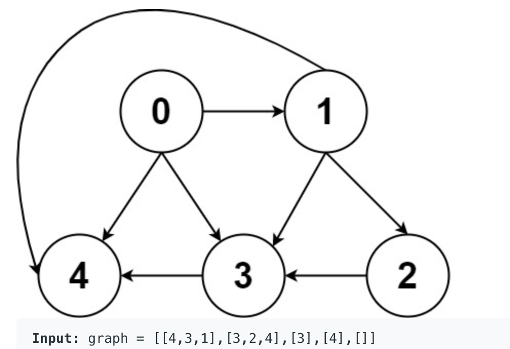
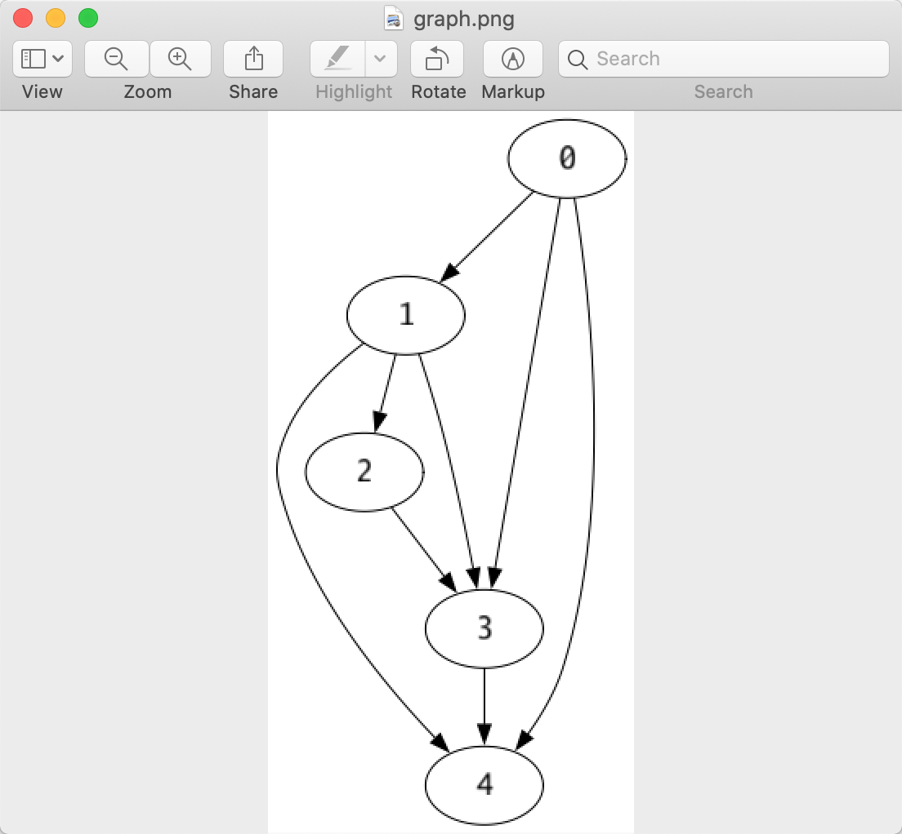

# leetcode-helper(for golang)

a library to help you display some data structure by leetcode input

## story

i like using IDE to solve leetcode problems, it's more efficient,

when i submit my solutions, sometimes my solutions will fail in some cases, 

and leetcode will be kind to tell us the input of the case

in which our submission failed.

but leetcode input is just a string, which may represent a tree or graph 

or linkedlist, etc. so if we can convert the input to the visual original data

structure, it would help us to figure out what's wrong.


## Tree

leetcode use a json array as input to represent a tree,

it's hard for us to read the tree.

with the helper, you can turn the input to a readable one, for example:

```go
func TestSum(t *testing.T) {
	input := `[9,6,-3,null,null,-6,2,null,null,2,null,-6,-6,-6]`
	tree := GetTreeFromInput(input)
	PrintTree(``, tree)
}
```

the function `GetTreeFromInput` turn the input to a tree,

and the func `PrintTree` will print the tree in text

the following is the printed tree:

```
         |-- 2
                 |-- -6
             |-- 2
                 |-- -6
                     |-- -6
     |-- -3
         |-- -6
 |-- 9
     |-- 6
```

the root is at the left most place, the left child locate blow the parent, 

the right child locate above the parent.

so the root is `9`, it's left child is `6`, it's right child is `-3`

for the node `-3`, it's right child is `2`


## LinkedList

the example code:

```go
func TestLinkedList(t *testing.T) {
	input := `1,2,3,4,5,6`
	head := GetLinkedListFromStr(input)
	// get int linked list instead of string
	//head := GetIntLinkedListFromStr(input)
	PrintLinkedListNode(head)
}
```

the output is 
```
1->2->3->4->5->6->
```


## Graph

leetcode use two-dimensional int array to represent graph.

for example: 




example code:

```go
func TestGraph(t *testing.T) {
	input := `[[4,3,1],[3,2,4],[3],[4],[]]`
	if err := RenderGraph(input); err != nil {
		panic(err)
	}
}
```
RenderGraph will pop up a window  displaying the graph(only tested on mac):


